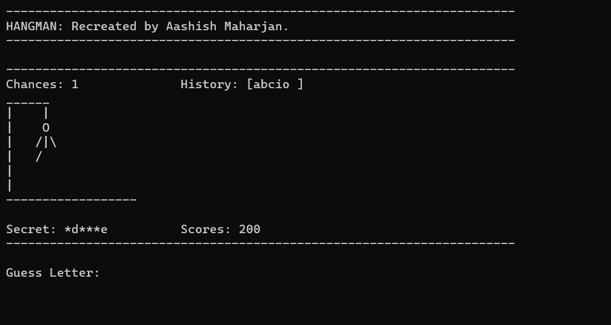

# Hangman Game in C Programming (Dynamic Programming)
Hangman Game in C Programming (Dynamic Programming) is developed by Aashish Maharjan inspired from an online creator. It is text based word guessing game.

* Developer's Name: Aashish Maharjan
* Version: 0.2.0
* First Updated: 5th May, 2019 
* Second Updated: 27th Feb, 2024
* Third Updated: 15th Mar, 2024
* Available on Github

[Visit Linkedin](https://www.linkedin.com/in/aacismaharjan/)

